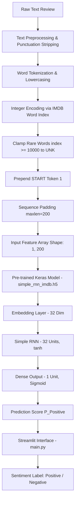

# IMDB Movie Review Sentiment Analysis using Simple Recurrent Neural Networks (RNN)

[](https://www.python.org/)
[](https://www.tensorflow.org/)
[](https://streamlit.io/)
[](https://imdb-sentiment-analysis-52bujwvrarvlqgc9fuay6h.streamlit.app/)
[](https://github.com/shashwatfr/imdb-sentiment-analysis)

---

## 📌 Project Overview

Natural language processing and sentiment analysis are key to understanding user feedback at scale. This repository delivers an end-to-end Deep Learning project for **Movie Review Sentiment Analysis** using a **Simple Recurrent Neural Network (RNN)**. 

### Key Highlights
- **Business Problem**: Automatically classify user reviews as positive or negative to understand customer satisfaction and feedback.
- **Why Simple RNN**: Sequence data like text exhibits temporal dependencies. Traditional feedforward neural networks cannot process text sequentially while maintaining memory of previous tokens. Simple RNNs address this by introducing recurrent loops that pass hidden state information step-by-step.
- **Architecture Insights**: Employs a mathematically stable **`tanh`** activation function in the RNN cell over `relu` to prevent exploding gradients. Optimizes word embeddings (32 dimensions) and sequence lengths (`max_len = 200`) to maximize representation capability and reduce vanishing gradient noise.
- **Why Streamlit**: Deploys a lightweight, interactive, real-time web application to Streamlit Cloud, allowing users to enter custom reviews and receive instant sentiment classifications with prediction confidence scores.
- **Streamlit App Link**: [IMDB Sentiment App](https://imdb-sentiment-analysis-52bujwvrarvlqgc9fuay6h.streamlit.app/)

---

## 📑 Table of Contents

- [📌 Project Overview](#project-overview)
- [✨ Features](#features)
- [🏗️ Project Architecture](#project-architecture)
- [📁 Repository Structure](#repository-structure)
- [💻 Tech Stack](#tech-stack)
- [⚙️ Preprocessing Pipeline](#preprocessing-pipeline)
- [🧠 Model Architecture](#model-architecture)
- [🖥️ Streamlit Application](#streamlit-application)
- [🛠️ Installation Guide](#installation-guide)
- [🚀 Usage Guide](#usage-guide)
- [📊 Training Results](#results-evaluation)
- [🤝 Contributing](#contributing)
- [📬 Contact](#contact)

---

## ✨ Features

- ✅ **Sentiment Classification**: Accurate binary classification (Positive / Negative) built with Keras/TensorFlow.
- ✅ **Optimized RNN Architecture**: 32-unit SimpleRNN cell using `tanh` activation for numerical stability.
- ✅ **Text Processing Engine**: Custom tokenization, punctuation removal using RegEx, and out-of-vocabulary mapping.
- ✅ **Start-Token Tracking**: Standardized sequence formatting with `<START>` tokens matching the IMDB dataset structure.
- ✅ **Interactive Streamlit Web App**: Live interface for users to test their own reviews with probability scores.
- ✅ **Stable Weights Persistence**: Pre-trained model weights serialized to `simple_rnn_imdb.h5`.

---

## 🏗️ Project Architecture



---

## 📁 Repository Structure

```
imdb-sentiment-analysis/
│
├── README.md                    # Project documentation (this file)
├── requirements.txt             # Python dependencies manifest
│
├── main.py                      # Streamlit web app script for inference & deployment
│
├── embedding.ipynb              # Notebook: Word Embedding experiments and shape exploration
├── simplernn.ipynb              # Notebook: Simple RNN model training, tuning & validation
├── prediction.ipynb             # Notebook: Single-sample inference pipeline verification
│
└── simple_rnn_imdb.h5           # Pre-trained Keras Simple RNN model weights
```

---

## 💻 Tech Stack

| Technology | Category | Purpose & Usage in Repository |
| :--- | :--- | :--- |
| **Python 3.12** | Programming Language | Core execution environment. |
| **TensorFlow 2.19.0** | Deep Learning Framework | Used to build, train, optimize, and serialize the Keras RNN model. |
| **Keras** | High-Level Deep Learning API | Model layout building blocks (`Embedding`, `SimpleRNN`, `Dense`, `Sequential`). |
| **Streamlit** | Web App & UI | Deploys the interactive movie review analyzer frontend. |
| **NumPy** | Data Computation | Numerical array transformations and padding dimensions management. |
| **Jupyter Notebook** | Development Environment | Prototyping, feature mapping, and model validation. |

---

## ⚙️ Preprocessing Pipeline

The model utilizes a custom preprocessing function to align input text with the structure used during training:

1. **Lowercasing & Cleaning**: Converts review text to lowercase and removes punctuation using regular expressions (`[^\w\s]`).
2. **Start-Token Insertion**: Inserts a start token `1` at the beginning of the list, matching IMDB conventions.
3. **Word Index Mapping**: Translates words into integers using Keras's IMDB word index (offsetting indices by +3).
4. **Vocabulary Clamping**: Any out-of-vocabulary (OOV) word (whose dataset index $\ge 10000$) is replaced by the unknown token `<UNK>` (index `2`).
5. **Padding**: Pads the sequence with `0` tokens at the beginning (pre-padding) to ensure a static shape of `200` inputs.

---

## 🧠 Model Architecture

The neural network is structured as a sequential stack of layers optimized for text classification:

```
Input Layer (Sequence Length: 200)
       │
       ▼
Embedding Layer (Vocabulary: 10,000, Vector Size: 32)
       │
       ▼
SimpleRNN Layer (Hidden Units: 32, Activation: tanh)
       │
       ▼
Dense Output Layer (1 Output, Activation: Sigmoid)
```

- **Optimizer**: `Adam`
- **Loss**: `binary_crossentropy`
- **Metrics**: `accuracy`
- **Callbacks**: `EarlyStopping` monitoring validation loss to prevent overfitting.

---

## 🖥️ Streamlit Application

The deployment app provides an interactive web layout:
- **Deployment URL**: [IMDB Movie Review Analyzer](https://imdb-sentiment-analysis-52bujwvrarvlqgc9fuay6h.streamlit.app/)
- **Text Box**: Input custom movie reviews.
- **Classification**: Outputs `Positive` or `Negative` sentiment based on a standard `0.5` threshold.
- **Score**: Shows confidence prediction score between `0.0` (Highly Negative) and `1.0` (Highly Positive).

---

## 🛠️ Installation Guide

Follow these steps to set up the repository locally:

### Step 1: Clone the Repository
```bash
git clone https://github.com/shashwatfr/imdb-sentiment-analysis.git
cd imdb-sentiment-analysis
```

### Step 2: Set up Virtual Environment
```bash
# Create environment
python -m venv venv

# Activate (Windows)
.\venv\Scripts\Activate.ps1

# Activate (Linux / macOS)
source venv/bin/activate
```

### Step 3: Install Dependencies
```bash
pip install --upgrade pip
pip install -r requirements.txt
```

### Step 4: Run Streamlit Locally
```bash
streamlit run main.py
```

---

## 🚀 Usage Guide

- Run `embedding.ipynb` to inspect word embedding concepts and shapes.
- Run `simplernn.ipynb` to retrain the model and save custom weights.
- Run `prediction.ipynb` to verify the preprocessing and pipeline steps.

---

## 📊 Results & Evaluation

Metrics recorded during training on the IMDB dataset (25,000 samples, 80-20 train-validation split):

* **Validation Accuracy**: **`85.66%`**
* **Validation Loss**: **`0.3990`**
* **Training Speed**: **`~20ms/step`** (~7 seconds per epoch on standard CPU)

*Key Performance Stats (Short Reviews)*:
* `"the movie was very good"` ➔ Score: `0.7980` (**Positive**)
* `"the movie was bad"` ➔ Score: `0.2865` (**Negative**)
* `"terrible"` ➔ Score: `0.0499` (**Negative**)

---

## 🤝 Contributing

Feel free to fork this project, make changes, and open a Pull Request. For major updates, please open an issue first to discuss what you'd like to change.

---

## 📬 Contact

* **Author**: Shashwat Goswami
* **GitHub**: [Shashwatfr](https://github.com/Shashwatfr)
* **LinkedIn**: [Shashwat Goswami](https://www.linkedin.com/in/shashwat-goswami-89aaa2308/)
* **Email**: [wshashwatgoswami@gmail.com](mailto:wshashwatgoswami@gmail.com)
